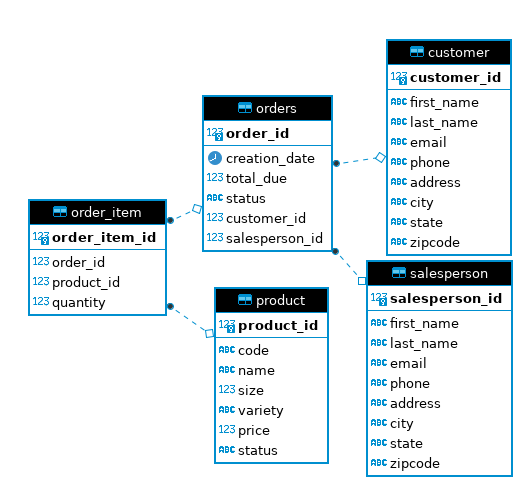

# Introduction
This application applied DAO Pattern in using JDBC for creating CRUD 
functions working with a dockerized Postgres Database. The tech-stack used 
in this project includes Java Core, Maven, JDBC, PSQL, Docker and DBeaver.

# Implementaiton
## ER Diagram

## Design Patterns

* Data Access Object (DAO) Pattern: allows us to separate the layer of 
application/business and the database using an abstract API. This pattern 
performs joining tables within the database using the foreign key 
relationships and is considered a good option when working with 
centralized database. DAO pattern is known as an abstraction of 
data persistence.

* Repository Pattern: is designed to focus on single table access per 
class. It also helps to hide all the works in the database from the 
application/business layer. The difference is that it joins tables
within code and therefore, it's good for using in distributed database 
systems. It is known as an abstraction of collection of objects.

Note: when dealing with a single table, both DAO and Repository patterns are 
very similar. In this project, we have been using DAO pattern.

# Test
The database was implemented using sql files through psql CLIs and 
checked using DBeaver and SQL queries.  

All the functions created in the DAO classes also were tested manually by
calling them from the main function of the JDBCExecutor class.
