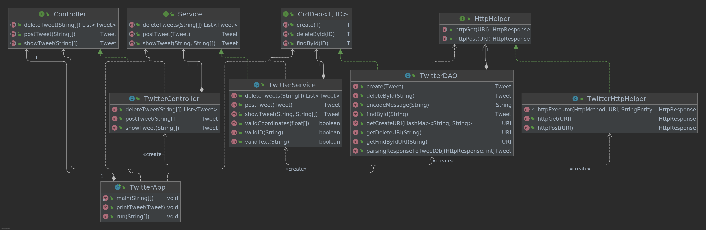

# Introduction
This app will perform create, delete and read Tweet using Twitter APIs.
The project structure applied MVC model and DAO pattern. Its requests were 
authorized with OAuth1.0a and run using ```httpclient```. Jackson-databind
was used for parsing Json string to java object and vice versa. Junit and Mockito were used
to perform unit tests and integration tests. The main method was then simplified 
using Spring Boot. Dockerfile was used to create docker image and published it to 
DockerHub

# Quick Start
## App usage:
- ```post```: post "tweet content" "longitude:latitude'
- ```show```: show "tweet id" "view field 1" "view field 2" ... "view field n"
- ```delete```: delete "tweet id 1" "tweet id 2" ... "tweet id n"

## Create uber jar file from maven:
```
    mvn clean compile package -DskipTests
```
`-DskipTests`: tell maven to skip the test cases which will cause error to build
jar file due to TweetId required.
## Run using uber jar:
```
    java -jar path/to/jar/file post|show|delete [other params]
```
Note: Make sure you already ```export``` the 4 secrets before running jar file.
## Run using Docker:
```
docker run --rm \
-e consumerKey=YOUR_VALUE \
-e consumerSecret=YOUR_VALUE \
-e accessToken=YOUR_VALUE \
-e tokenSecret=YOUR_VALUE \
phuongly/twitter post "tweet content" "longitude:latitude"
``` 

# Design
## UML diagram

## TwitterController
Perform matching user input with corresponding service. For instance, calling postTweet from Service component
when user put in ```post```. There is no business rule performed in Controller. 
## TwitterService
Checking user input whether it qualified the business rules and then call the corresponding
DAO method. In this project, a tweet can't exceed 140 characters, an ID must be an unsigned 64bit integer and
coordinates must be within -180 to 180 for longitude and -90 to 90 for latitude.
## TwitterDAO
This component will help to work with Twitter APIs using HttpHelper.
It performs request to Twitter APIs and parsing the response into java Tweet object
with the help of JsonParser class and URLEncoder.
## TwitterHttpHelper
It provides HttpClient for making requests and return responses. The requests will also
be authorized with OAuth1.0a.  
## Main/Spring
Main method or Spring class will help to set up the components and their relationships, then run  the 
project when called. The response will be printed into PrettyJson string.
## Models
There are 5 models in this project to make up a simplified version of 
Tweet Object. They are Coordinates, Entities, Hashtag, UserMention and Tweet. 
## Spring
Traditionally the dependencies will be set up in main method
for running the project. It will become a problem if the amount of dependencies 
becomes large. Spring provides dependencies management to solve the issue. By annotating
classes under management of the main method using annotations (@Component, @Service,
@Controller,@Repository), it tells IoC Container in Spring to manage the dependencies 
and their relationships.  
Spring has Bean and ComponentScan approaches. Since Bean approach still requires many manual works, 
ComponentScan gives a better way to implement the relationships between components. 
```TwitterCLISpringBoot``` class helps to quickly config Spring project.

# Test
Each component was tested with unit and integration tests using Junit 4. Mockito
was used to mock objects for class independent testing.

## Deployment
1. Create docker image from uber jar using Dockerfile: 
    ```
    docker build -t phuongly/twitter .
    ```
    Note: Must be in the same directory with the Dockerfile

2. Publish image to DockerHub  
```Docker push phuongly/twitter```  
Note: Login with ```docker login``` before pushing.
# Improvements
- Make more comprehensive Tweet Object
- Create some more overload for showTweet (E.g. show Tweet using account name)
- Perform caching all requests within 1 minute for saving API costs and improve performance