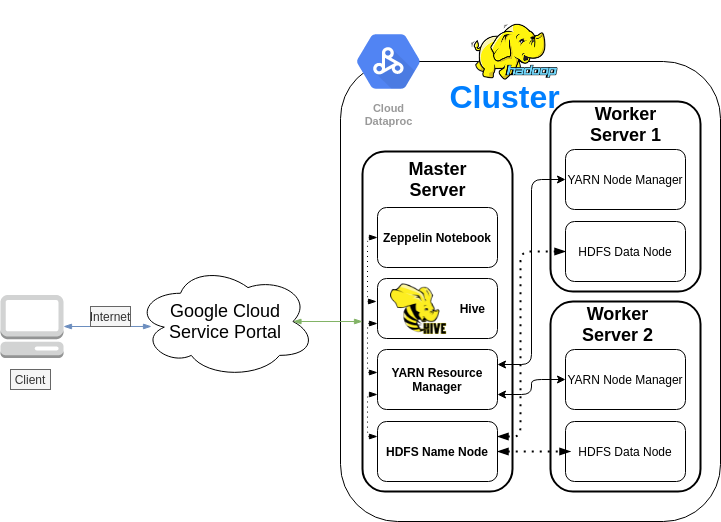
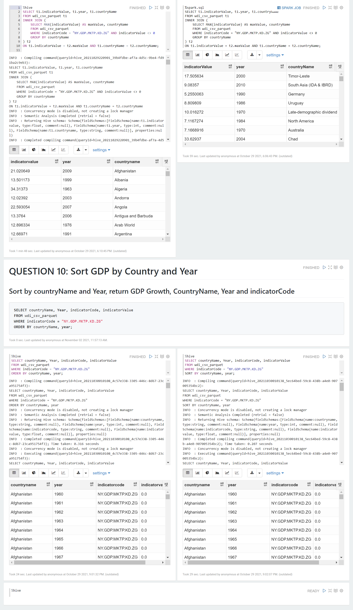

# Hadoop Project

## Table of contents
* [Introduction](#Introduction)
* [Hadoop Cluster](#Hadoop-cluster)
* [The Hive Project](#Hive-project)
* [Improvements](#improvements)

## Introduction
- This project helps the data analytic team process big data using Apache Hadoop and other tools including HDFS, YARN, MapReduce, Hive, and Zeppelin. 
- A public big table called `patents-public-data/worldbank_wdi/wdi_2016` provisioned by Google BigQuery was then exported to Google Storage as `csv.gz` files for manipulating data from our Hadoop cluster. 
- The cluster includes 1 Master and 2 Workers instances. Files from Google Storage were then copied to HDFS as `text`. 
- Hive was used to perform the queries. `OpenCSVSerDe` was applied for more comprehensive parsing. The queries' performance was improved by `PARTITION` and `Columnar (Parquet) file`.    

## Hadoop Cluster
### Hardware specifications
- Master Node (2 CPU cores - 12 GB Memory - 100 GB Storage): 1 Node
- Worker Node (2 CPU Cores - 12 GB Memory - 100 GB Storage): 2 Nodes

### cluster architecture diagram

###Big data tools
  - MapReduce
    - MapReduce is a framework that allows developers to implement algorithms in the MapReduce programming model for computing large-scale data in the distributed file system. It consists of 2 parts: Map and Reduce. The number of reducers will be less than the number of mappers due to the characteristic of the MapReduce model.
    - Map phase: file chunks are read with the help of InputFormat, InputSplit, and RecordReader to give output as a set of key-value pairs (key is the offset, value is the line content) for Mapper to use. The Mapper then maps the data to give an output of desired key-value pairs. There can be a Combiner that is used as a small mapper-side reducer to reduce the amount of data that need to be transferred over the network. Finally, Partitioner will send the key-value pairs to the corresponding Reducer in the cluster.   
    - Reduce phase: all values with the same key will be processed within the same Reducer. They will be sorted first and then put into Reducer to have a single combined result.
  - YARN
    - YARN helps to separate the resource managing from MapReduce jobs. It manages resource and control jobs execution, such as scheduling, resource allocation, and managing containers. Thus, allowing some MapReduce alternatives (Spark, Tez) to run on top of YARN.
    - Resource Manager - Node Manager: Resource manager takes responsibility to monitor and control all resources within the cluster which are reported by Node Managers (CPU, Memory, Disk, Network I/O). Therefore, it can allocate resources for a job to run. Some common scheduling algorithms, such as FIFO - provide a resource to the job in a queue, Capacity - jobs can run in parallel if the resource is available, and Fair Share - all jobs have an equal chance to have the resource to run.
    - Application Master - Container: Application Master monitors and controls all Containers to perform distributed tasks. If a Container failed to execute a job, Application Master will be able to launch another Container to perform the job if the resource is available (requested from the Resource Manager).
  - HDFS
    - It's a Distributed File System that comes with Hadoop. Including NameNode (manage metadata) and DataNode (where actual data is stored).
    - `NameNode` stores Metadata includes file paths, replica location, size, permissions, etc. It also receives block reports and heartbeat messages from DataNode to keep track of the DataNodes status and manage the data across the cluster.
    - `DataNode` stores data blocks which are chunks of a big data file (each block has 128 MB data by default). DataNode will send block reports and heartbeat signals to NameNode to keep it up-to-date. If there is no heartbeat within 10 minutes, a DataNode is considered death/unavailable. Hence, NameNode will check and replicate data on the death node from other nodes to make sure there are 3 replications (by default) of each block across the cluster.
  - Hive
    - Some details about Hive go here.
  - Zeppelin
    - Zeppelin provides a web interface to work with Hadoop. It allows writing executing and storing the commands in `Notebook`, which can be edited and re-used.
    - The `Notebook` organizes tasks in `paragraphs` and can be executed using `interpreters`. Users can configure their own `interpreter` in Zeppelin and use it in a `paragraph` by placing the `%interpreter_name` command above the code block.
## Hive Project
In order to improve performance of Hive queries:
### Improving hive queries
#### Partitions Dataset
- `PARTITION` keyword is used in creating Hive tables, which will divide the dataset into partitions based on the given column(s).
- There are two partition types:
  - `Static`: manually partition using specific values in the partition column. This is a good way for loading big data files into Hive tables. It is faster than the dynamic partition.
  - `Dynamic`: dynamically partition the dataset into partitions based on values of the partition columns. This is a convenient option when loading data from another Hive table.   
Note: when mixing static and dynamic, static must come first. 
If there is no static partition, use `set hive.exec.dynamic.partition.mode=nonstrict` to allow fully dynamic partition.

#### Columnar File (Parquet File)
- `STORED AS PARQUET` is used when creating a hive table to have to dataset stored as columnar files. 
- Columnar files are files with parquet extension, a parquet file size is a lot smaller than a normal text file and its processing time is also a lot faster than text files.

### Zeppelin Notebook screenshots

## Improvements
- Bucketing can also be used to improve query performance when dealing with big data files.
- Combining Parquet files with partitioning to see how fast the query can be.
- Explore other Columnar file types and compare them to Parquet.