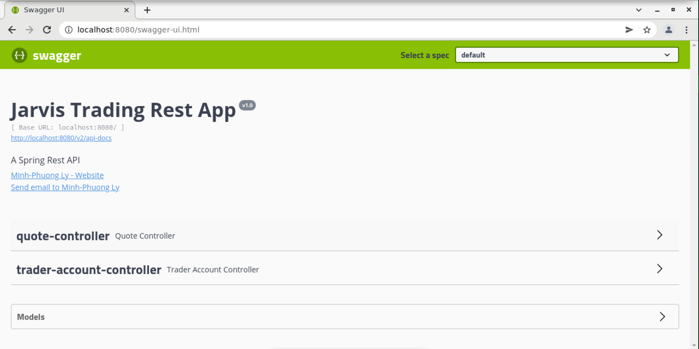
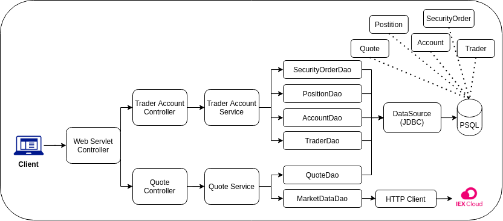

Table of contents
* [Introduction](#Introduction)
* [Quick Start](##QuickStart)
* [Implemenation](##Implemenation)
* [Test](##Test)
* [Deployment](##Deployment)
* [Improvements](##Improvements)

# Introduction
This project is mainly for replacing the legacy system of Jarvis's Trading team, which is hard to scale and manage. 
It used `microservice` architecture, `Springboot` framework, and other technologies such as `Postgres`, `DataSource`, `Docker`, etc.
Stock data from `IEX Cloud` is fetched (from IEX free REST APIs) and persists on an internal database for allowing clients to perform trading and checking the stock market. 
Integration tests were performed using `Junit 4` and `Swagger` was used to have a Web UI for working with the APIs of the trading app.

# Quick Start
- Prerequisites: Docker, CentOS 7
- Steps to set up the application:
  - Create a docker network

        sudo docker network create trading-net

  - Execute the Dockerfile in psql `./springboot/psql`

        cd ./springboot/psql
        docker build -t trading-psl . 
        docker image ls -f reference=trading-psl

  - Execute the Dockerfile in springboot `./springboot/`
    
        cd ./springboot/
        docker build -t trading-app . 
        docker image ls -f reference=trading-app
  
  - Create a volume for persisting data in docker
  
        docker volume create pgdata-trading
  
  - Start the trading-psl docker container

        docker run --name trading-psql-dev \
        -e POSTGRES_PASSWORD=password \
        -e POSTGRES_DB=jrvstrading \
        -e POSTGRES_USER=postgres \
        --network trading-net \
        -v pgdata-trading:/var/lib/postgresql/data \
        -d -p 5432:5432 trading-psl

  - Obtain your _IEX_PUB_TOKEN_ and start the trading-app docker container

        docker run -d -t --name trading-app-dev \
        -e "PSQL_URL=jdbc:postgresql://trading-psql-dev:5432/jrvstrading" \
        -e "PSQL_USER=postgres" \
        -e "PSQL_PASSWORD=password" \
        -e "IEX_PUB_TOKEN=${IEX_PUB_TOKEN}" \
        --network trading-net \
        -p 8080:8080 -t trading-app

- Try trading-app with SwaggerUI by accessing `http://localhost:8080/swagger-ui.html` from your browser

# Implemenation
## Architecture

- _Controller layer_: call corresponding service to process and return a result.
- _Service layer_: check if the requests and their inputs qualify business rules before processing it.
- _DAO layer_: work with the database and perform the clients requirements. 
- _SpringBoot_: manage the dependencies and their relationships for the application to be able to run and listen to clients' requests (Web servlet/Tomcat).
- _PSQL and IEX_: get market data from `IEX Cloud` and persist data using `PSQL` for later manipulating.

## REST API Usage
### Swagger
`SwaggerUI` allows the clients and developers to interactively access the Springboot Application through a web UI without the need of dealing with the implementation.
### Quote Controller
- It contains endpoints that help to get data from `IEX Cloud` and store it to `PSQL` for later manipulating.
- Its endpoints:
    - `GET /dailyList`: Lists all the quotes that are available to be traded from your dailyList
    - `GET /iex/ticker/{ticker}`: get information of the given ticker (symbol/stock)
    - `PUT /quote/iexMarketData`: update stock information for all the quotes in your daily list
    - `PUT /quote`: save a quote into your dailyList manually
    - `POST /tickerId/{tickerId}`: get information of the given tickerId from `IEX` and save it to your dailyList
### Trader Controller
- It is used to manage trader profiles and accounts.
- Its endpoints:
  - `POST /trader/`: create a trader profile and account.
  - `POST /trader/firstname/{firstname}/lastname/{lastname}/dob/{dob}/country/{country}/email/{email}`: same as the above endpoint but using path params instead of request body.
  - `PUT /trader/deposit/traderId/{traderId}/amount/{amount}`: deposit money to the account based on the traderId
  - `PUT /trader/withdraw/traderId/{traderId}/amount/{amount}`: withdraws money from the account based on the traderId
  - `DELETE /trader/traderId/{traderId}`: delete a trader by their traderId

# Test
All Services and Dao classes have been tested using `Junit 4`. The line coverage was more than 70%
# Deployment
- Docker images were made for the `Trading App` and the `PSQL database`. They were then pushed to DockerHub for deployment.
- Perform below commands for getting the app and reference the `QuickStar` for usage:  

      docker pull phuongly/trading-psql
      docker pull phuongly/trading-app

# Improvements
- Implements Trader and Order Services and Controllers
- Get top trending stocks
- Making a real time dashboard for monitoring stock market data.

